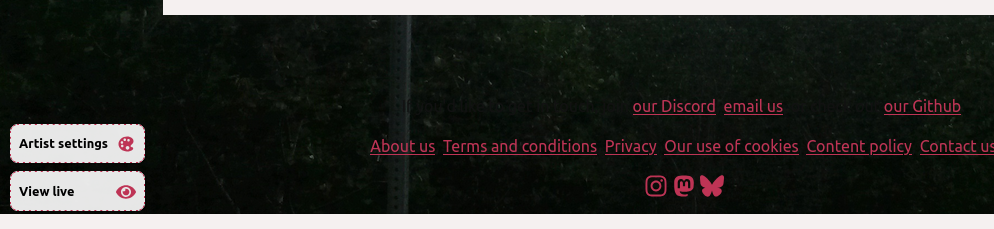

You can customize your artist page in quite a few ways.

## Change the look of your artist profile page.

When viewing your artist, you can see a series of toggles in the bottom left menu:

Clicking on artist settings allows you to change the colors, profile picture, background image, etc of the artist page.

## Change how much money goes to Mirlo for my profile page.

Go to your artist's setting page and change the default platform fee.

You can additionally change the fee for each release or merch item.
