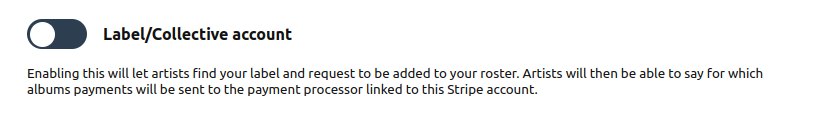

# Label Pages

How do label pages work?

Label pages work much the same way as artist pages, where you can do the following:

- Add a link to your website.

- Write a short sentence describing what you do.

- Add a more detailed “about” paragraph.

- Add tour dates. Perhaps you’re hosting an all-dayer gig as a label? You can include it in the dates tab and link to the ticket vendor and/or venue.

- You can create artist pages to display your roster, plus releases and merch that are exclusive to your label. Alternatively, if the artist and their releases already exist on Mirlo, they can be linked to the label page.

- You have the option to set detailed shipping profiles for your merch.

- As a label you can decide whether you or the artist receives direct payment for a release.

- You can add your socials.

- You can collect emails or give your audience the chance to follow via RSS.

- You can view pages for both sales and order fulfilment.

- You can generate album and track codes for press, friends and family.

- You can add catalogue numbers to better organise your releases.

## How do I enable this?

To start with, you need an account on Mirlo. You can create one [by signing up](https://mirlo.space/signup). Once you've done that, you can go to your [profile page](https://mirlo.space/profile) and toggle the Label/Collective account toggle. Press "Update Profile" and you're good to go.

Once you've turned that on, you're ready to get going! You can manage the details of your label account [on your label management page](https://mirlo.space/profile/label).

## Adding artists to a label page

You can add artists to your profile [on your label management page](https://mirlo.space/profile/label).

## Next step for label pages

Check our [GitHub page for our in-progress work](https://github.com/funmusicplace/mirlo/milestone/6) on label pages.
