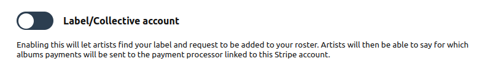

# Label & Collective Accounts Guide

## What Are Label Accounts?

Label accounts on Mirlo let you manage multiple artists, releases, and merchandise under a unified brand. Whether you're running an independent label, collective, or artist cooperative, label accounts give you:

- A public profile showcasing your roster and releases
- Tools to invite and manage artists
- Control over payments (label vs artist)
- Separate analytics for label activity
- Branding and customization options
- Merchandise management with shipping profiles

## Getting Started with Label Accounts

### Step 1: Enable Label Mode

1. Go to your [account page](https://mirlo.space/account)
2. Scroll down and find the **"Label/Collective account"** toggle
3. Enable it
4. Click **"Update account"**



Your account is now in label mode. You'll automatically get a label profile artist page at `mirlo.space/{your-url-slug}/`.

### Step 2: Set Up Your Label Profile

Visit your [label dashboard page](https://mirlo.space/profile/label) to get an overview of your label's content. Click on "Edit label profile" to edit:

- **Label Name** - Your label's official name (can differ from your username)
- **URL Slug** - Custom URL segment (e.g., `/my-label/`)
- **Avatar** - Label logo or image
- **Banner** - Header image for your label page
- **About** - Short tagline describing what you do
- **Bio** - Detailed description of your label's mission and style
- **Website** - Link to your external website or portal
- **Social Links** - Twitter, Instagram, Bandcamp, etc.
- **Tour Dates** - Add upcoming label events or showcases

Your label profile will appear publicly at `mirlo.space/{slug}/` and showcase your roster.

## Managing Your Roster

### Adding Artists to Your Label

You have two ways artists can join your label:

#### Option 1: Invite an Artist

1. Go to [Label Management](https://mirlo.space/profile/label)
2. Find the **"Manage your artists"** section
3. Search for an existing Mirlo artist by username or email
4. Send the invitation

The artist will receive an email invitation. They can accept or decline in their artist settings. Once accepted, they appear on your roster.

#### Option 2: Create a New Artist Profile

If the artist isn't on Mirlo yet:

1. Go to Label Management
2. Create a new artist profile for them
3. Add their details (name, bio, links, etc.)
4. They can later claim the profile with their own account

#### Option 3: Existing artists on your user profile.

Existing artists on your user profile will appear underneath the Manage your roster section. You can opt to add these artists to your roster.

## Setting Up Releases & Merchandise

### Creating Releases Under Your Label

Depending on permissions, label managers and artists can create releases:

1. On your or your artist's profile page, go to **"Releases"**
2. Click **"Upload New Release"** (album, EP, single, or mixtape)
3. Add details:
   - Title, artist name, credits
   - Audio files for each track
   - Artwork
   - Release date
   - Pricing (if selling)
4. Configure sales settings:
   - **Who receives payment:** Label or artist (see **Payment Routing** below)
   - **Platform fee:** 10% default (customizable by artist/label)
5. Publish the release

### Creating Merchandise

Labels can set up merch just like artists:

1. Go to **"Merch"** on your or your artist's profile page.
2. Add items with:
   - Name and description
   - Images
   - Pricing (one-time or subscription)
   - Shipping profiles (see Shipping section)
3. Link to an artist or sell directly from the label page

### Shipping Profiles for Merchandise

For physical merch, set up detailed shipping rules:

1. Go to **"Merchandise Settings"** → **"Shipping"**
2. Define shipping rates by:
   - **Location** (domestic, international, specific countries)
   - **Weight or flat rate**
   - **Speed** (if offering multiple options)
3. Customers see applicable rates at checkout

## Payment Routing: Label vs. Artist

A key feature of label accounts is flexibility in **who gets paid** for each release or item.

### How Payment Routing Works

When someone buys a release or merch from your label:

```
Customer purchase
    ↓
Stripe processes (2.9% + $0.30)
    ↓
Mirlo platform fee (10% default)
    ↓
PAYMENT ROUTES TO:
├─ Label Stripe account, OR
└─ Artist Stripe account
    ↓
Payout to bank account
```

### Setting Payment Receiver per Release

When creating or editing a release, you can specify:

- **Route to label** - Label receives artist's share (label owns the release or is taking a cut)
- **Route to artist** - Artist receives direct payment (label is just managing the profile)

This is set per-release or per-merch item, giving you flexibility:

- Label-signed releases → route to label
- Independent artist on your roster → route to artist
- Collaborative projects → split manually (not yet automated)

**Important:** The receiving account must have a Stripe Connected Account set up. See [Payouts Guide](../payouts.md).

## Sales & Analytics

### Sales Dashboard

Track all label and artist sales:

1. Go to **"Sales"** in your label dashboard
2. View metrics:
   - Total revenue and transactions
   - Sales by artist, release, or time period
   - Platform fees vs. Stripe fees deducted
   - Artist payouts and balances
3. Export data as CSV for accounting

### Supporters Management

See who's buying from your label:

1. Go to **"Supporters"** in your label profile
2. View:
   - Customer names and amounts (if not anonymous)
   - Purchase history
   - Subscription revenue
   - Top supporters

### Press/Promo Codes

Generate promotional codes for press, friends, and family:

1. Go to **"Download Codes"**.
2. Create codes with:
   - Number of uses
   - Applied to specific releases
3. Share the codes.

Customers can use the codes to get a free copy of the album.

### Catalogue Numbers

Organize your releases with catalogue numbers:

1. When creating a release, add a **"Catalogue Number"** (e.g., `LABEL001`)
2. This appears on the release page and helps organize your discography
3. Filter releases by catalogue number in your dashboard

## Merch & Audio Collaboration

### Hosting Artist-Specific Merch

Artists on your roster can have:

- **Their own artist profile** with merch (if they have manage permissions)
- **Label-managed merch** on the main label page
- **Mixed approach** - different merch on different profiles

## Customization & Branding

### Label Page Customization

Make your label distinct:

- **Colors** - Set theme colors for your label page
- **Featured releases** - Pin key releases to the top of your page
- **Tour dates** - Add upcoming label nights, showcases, or festival appearances
- **Email collection** - Let fans subscribe to your mailing list
- **RSS feed** - Provide an RSS feed for your releases
- **Social web integration** Enable the social web on your profile to automatically have your label be discoverable by others.

## FAQ & Troubleshooting

### Can I create multiple label accounts?

If you manage more than one label, you will have to create a separate Mirlo account. Each Mirlo account is tied to a single Stripe account.

### Can an artist be on multiple labels?

If an artist is the primary manager of their Mirlo page, they can choose to have different releases paid out to different labels. However, only one label can manage an artist account at a time.

### How do I change who receives payment on an existing release?

Payment routing is typically set at creation. Depending on your setup, you may not be able to change it retroactively.

### Can I disable a label without losing my releases?

Disabling label mode disconnects you from your roster, but releases remain on Mirlo. You can re-enable label mode anytime to reclaim your roster.

## Related Documentation

- [Payouts Guide](../payouts.md) - How labels and artists receive money
- [Artist Pages Guide](./setting-up-an-artist-account.md) - Individual artist profiles
