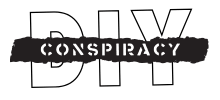
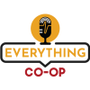
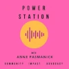
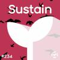

---
# https://vitepress.dev/reference/default-theme-home-page
layout: home

hero:
  name: "Mirlo:"
  text: "Documentation for an open source music sales and patronage platform."
  tagline: 🐦‍⬛
  actions:
    - theme: brand
      text: Mirlo features
      link: /features
    - theme: alt
      text: FAQ
      link: /faq
    - theme: alt
      text: Maintaining
      link: /maintaining
# features:
#   - title: Feature A
#     details: Lorem ipsum dolor sit amet, consectetur adipiscing elit
#   - title: Feature B
#     details: Lorem ipsum dolor sit amet, consectetur adipiscing elit
#   - title: Feature C
#     details: Lorem ipsum dolor sit amet, consectetur adipiscing elit
---

Mirlo provides a user-friendly space to help artists sell digital music, receive financial support, manage mailing lists, and share with their supporters.

## Our mission

The music industry does not work for artists or listeners and needs a radical re-imagining.

Mirlo hosts a community of artists, listeners, organizers, and coders who are daring to do just that: taking lessons learned from working in the solidarity economy and applying them to our platform.
We are building an online audio distribution and patronage platform that aims to be radical, accessible, open source (free & libre), modular, and standards based.

## Our story

The idea of Mirlo grew out of conversations that began in late 2022 as a handful of musicians, technologists, and mutual aid organizers began to find each other and reflect on their experiences working with two ongoing music cooperative initiatives at the time, [Ampled](https://ampled.com/) and [Resonate](https://resonate.coop/). Through those conversations, we began to develop a shared analysis of today’s precarious music industry and invited others to join us in the conversations we published online at [Fun Music Place](https://funmusic.place/). We also started to [dream together](https://funmusic.place/blog/the-spotify-ai-blues/) about what alternatives that foregrounded mutual aid and the value of musical creativity might actually look like. Two of the group members, LLK and Si, wrote code for an initial software product.

As these conversations unfolded, Bandcamp was sold again, firing half of their employees in the process. We realized the heightened need for viable alternatives to the corporate giants. Ultimately, three of us who were based in the United States [formed an LLC](https://mirlo.space/team/posts/10/) and became the [official co-founders and worker-owners](https://mirlo.space/pages/about#team), with other contributors continuing to offer support internationally. We joined the [US Federation of Worker Cooperatives](https://www.usworker.coop/en/) and [Beloved Community Incubator](https://www.belovedcommunityincubator.org/) as startup members and are currently finalizing our operating agreement to incorporate consent-based cooperative governance into our foundational protocols, inspired by the principles of [Sociocracy](https://www.sociocracyforall.org/sociocracy/).

## In the media

Want to to talk to us? Contact us at [hi@mirlo.space](mailto:hi@mirlo.space).
