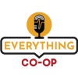
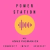
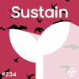

---
# https://vitepress.dev/reference/default-theme-home-page
layout: home

hero:
  name: "Mirlo:"
  text: "Documentation for an open source music sales and patronage platform."
  tagline: 🐦‍⬛
  actions:
    - theme: brand
      text: Mirlo features
      link: /features
    - theme: alt
      text: FAQ
      link: /faq
    - theme: alt
      text: Maintaining
      link: /maintaining
# features:
#   - title: Feature A
#     details: Lorem ipsum dolor sit amet, consectetur adipiscing elit
#   - title: Feature B
#     details: Lorem ipsum dolor sit amet, consectetur adipiscing elit
#   - title: Feature C
#     details: Lorem ipsum dolor sit amet, consectetur adipiscing elit
---

Mirlo provides a user-friendly space to help artists sell digital music, receive financial support, manage mailing lists, and share with their supporters.

## Our mission

The music industry does not work for artists or listeners and needs a radical re-imagining.

Mirlo hosts a community of artists, listeners, organizers, and coders who are daring to do just that: taking lessons learned from working in the solidarity economy and applying them to our platform.
We are building an online audio distribution and patronage platform that aims to be radical, accessible, open source (free & libre), modular, and standards based.

## Features and FAQ

Want a full product walkthrough? See [Mirlo features](/features/index.md).

Looking for common questions? Read the [FAQ](/faq).

## Our story

Want to read about how Mirlo came to be and who's behind it? [Read our story](/story).

## In the media

Want to talk to us? Contact us at [hi@mirlo.space](mailto:hi@mirlo.space).
