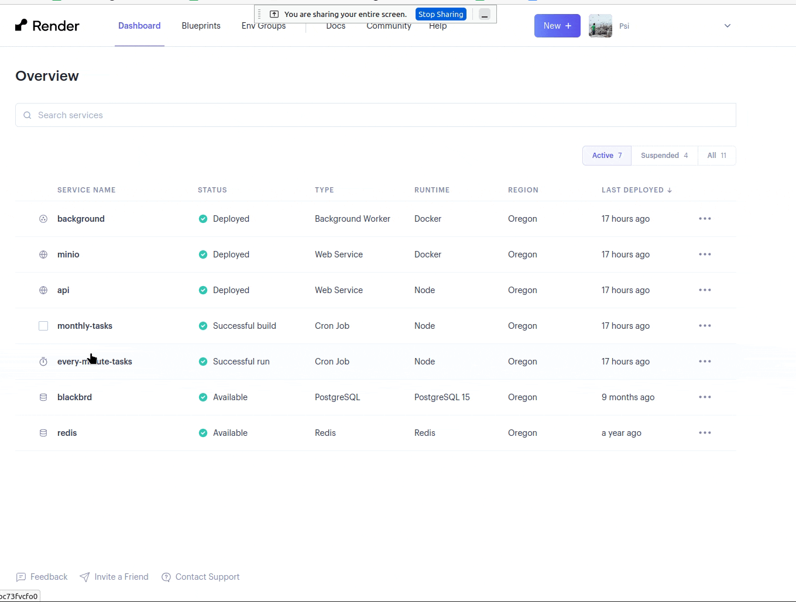

# Rapid Response

It could happen that something goes wrong, and that whoever knows best might not be able to fix it right away. This guide is to help make decisions on what the appropriate response is. It should be a living document and built based on experience.

## Resolving DNS issues

We've had a weird instance where things in Cloudflare seem to not be connecting to the website. Here's some things to try:

- Disable proxying on Cloudflare. This should be instant.
- Disable the Custom DNS on Namecheap. This might take a second to update.

## Something wrong at a regular interval

It could be that something is repeatedly going wrong at a very regular interval--the most obvious indication of this is if an e-mail is getting sent out every x minutes. This likely means that a cron job is breaking and not completing, and the next time it runs it tries to do it with the same set of information. See: the famous April 13 incident with the April Update Email, which some users received 11 times.

We've got two cron jobs: every-minute-tasks (runs every 10 minutes) and monthly-tasks (runs every month). These are controlled by two separate Render services, which you can find on [the dashboard](https://dashboard.render.com/).

You can see what these jobs do in the `src/jobs/monthly-tasks.ts` and `src/jobs/every-minute-tasks.ts` files.

Currently there's nothing critical that a cron job does that needs to run every ten minutes, so it is safe to suspend both of these jobs until we're able to figure out what is wrong. Here's how:

.

> Note: suspending any other service (anything that is not a cron job) will negatively impact the service and likely make core functionality unavailable. Suspending the service is **likely not the solution** for those scenarios.

### Then

Critically, it's not just about turning off the service. Once it off **We need to fix things** so that we can turn it back on!

First, [make an issue on GitHub](https://github.com/funmusicplace/mirlo/issues). Add _everything you know to it_, including either copies of what was happening, or links to conversation threads, as well as what you did to temporarily fix it.
