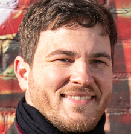
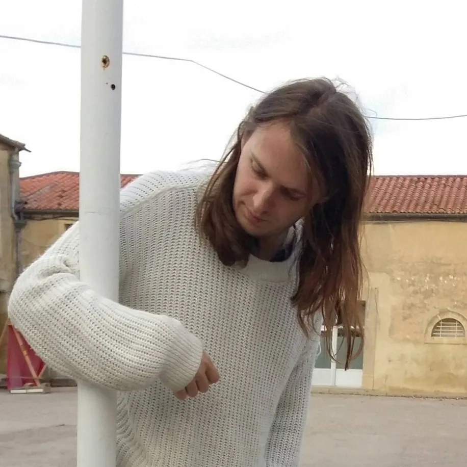
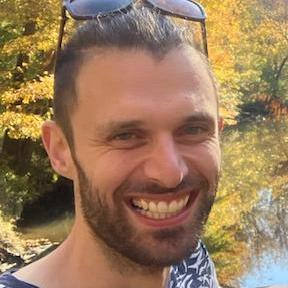
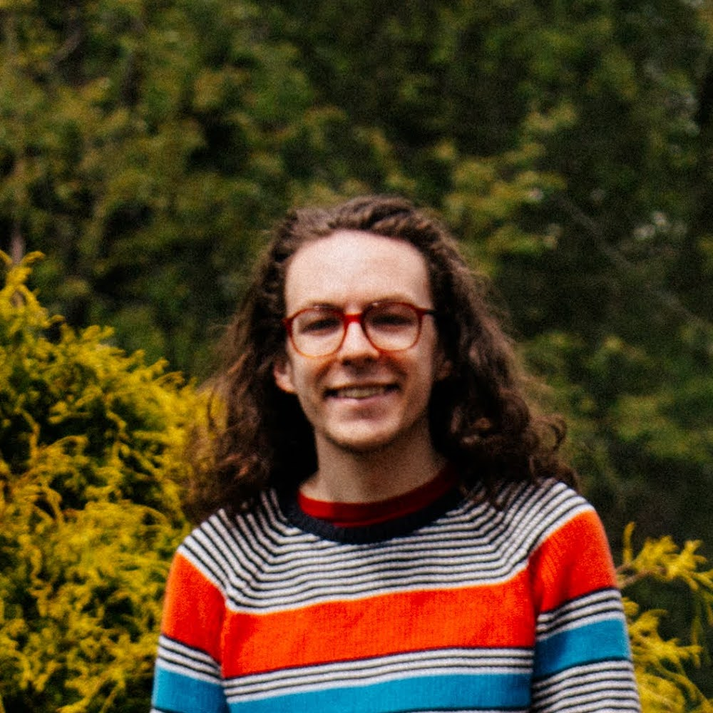

# Our story

The idea of Mirlo grew out of conversations that began in late 2022 as a handful of musicians, technologists, and mutual aid organizers began to find each other and reflect on their experiences working with two ongoing music cooperative initiatives at the time, [Ampled](https://ampled.com/) and [Resonate](https://resonate.coop/). Through those conversations, we began to develop a shared analysis of today’s precarious music industry and invited others to join us in the conversations we published online at [Fun Music Place](https://funmusic.place/). We also started to [dream together](https://funmusic.place/blog/the-spotify-ai-blues/) about what alternatives that foregrounded mutual aid and the value of musical creativity might actually look like. Two of the group members, LLK and Si, wrote code for an initial software product.

As these conversations unfolded, Bandcamp was sold again, firing half of their employees in the process. We realized the heightened need for viable alternatives to the corporate giants. Ultimately, three of us who were based in the United States [formed an LLC](https://mirlo.space/team/posts/10/) and became the [official co-founders and worker-owners](#our-team), with other contributors continuing to offer support internationally. We joined the [US Federation of Worker Cooperatives](https://www.usworker.coop/en/) and [Beloved Community Incubator](https://www.belovedcommunityincubator.org/) as startup members and are currently finalizing our operating agreement to incorporate consent-based cooperative governance into our foundational protocols, inspired by the principles of [Sociocracy](https://www.sociocracyforall.org/sociocracy/).

## Our team

Our member stewards have experience working both within Resonate and Ampled, other co-ops across several industries, and complex high-traffic web platforms. We envision this platform as a tool to support musicians in cultivating direct and reciprocal relationships and resources to sustain one another's creative practice.

While Mirlo is legally incorporated as an entity recognized by the United States of America, our work is hugely dependent on a network of people who have helped us get to where we are.

We are immensely grateful to everyone who is supporting us through labor or financial contributions to get us here.

### Our operating agreement

We are delighted to publicly share [our operating agreement](https://mirlo.space/static/Mirlo-Bylaws.pdf). The company is managed by its [member stewards](https://mirlo.space/team/posts/285/), listed below.

Decisions on behalf of the company are made by consent of member stewards, meaning that no member steward objects to the decision taken. Feel free to [learn more here](https://www.sociocracyforall.org/consent-decision-making/) about consent-based decision-making from our friends at Sociocracy for All.

Stewards are the people who, through their contributions, help move Mirlo forward; we want to ensure that anyone doing this work has an opportunity to contribute meaningfully to the decisions that impact how the platform runs itself. When someone joins Mirlo as a steward, they can also become legal owners, but that is not a requirement. Either way, stewards are invited to the regular member meetings and consent to decisions that impact the overall ecosystem alongside legal members. To read more about how member stewards operate within Mirlo, read our [blog post about it](https://mirlo.space/team/posts/285/).

Work at Mirlo is done in circles, defined teams that can include both stewards and organizer volunteers. Those circles can make decisions within their delegated domain by consent, without having to run it by the full members' circle. [This article from Sociocracy for All](https://www.sociocracyforall.org/organizational-circle-structure-in-sociocracy/) offers a good introduction to the organizational logic behind circles, based on the principles of effectiveness, equivalence, and transparency.

### The member stewards

	
	

		<h4>Alex</h4>
		
Alex is a writer, organizer, and trombonist working at the confluences of music and social transformation. His writing on the contemporary jazz world has appeared in The Newark Star-Ledger, NPR Music, LA Weekly, and DownBeat, among other outlets. Alex has also worked in the solidarity economy movement as co-founder of the mental health worker cooperative Catalyst Cooperative Healing, as facilitator for the Sociocracy for All Cooperatives Circle, and as an Artist-Owner of Ampled. Alex is a legal owner of Mirlo.

	

	
	

		<h4>Louis-Louise Kay (LLK)</h4>
		
Louis-Louise Kay is a French musician and organizer, who has been creating music for games, movies, animation, and as a solo artist under the moniker <a href="https://mirlo.space/mowukis">MOWUKIS</a>. LLK has contributed to code, design, community engagement, and business strategy since Mirlo's beginnings.

	

	
	

		<h4>Roberta</h4>
		
Roberta is a musician, video maker, and amateur puppeteer from the Isle of Wight, UK, making "wildly maximalist, mildly-anarchic pop music" and has appeared on The Guardian, The Independent, and KEXP.

		
She has also previously worked as a designer and marketer, occasional stage manager, and been involved in an independent makers group support network as a co-organizer and social media manager, securing funding for events and creating an online community hub.

	

	
	

		<h4>Simon</h4>
		
Simon is a mutual aid, solidarity economy, and dual power organizer in DC. In his free time he plays soccer and doodles. He used to have a weekly radio slot on public radio, and has done music journalism in a past life. As a wage laborer he has worked as a software developer for UN organizations, Fortune 500 companies, user experience agencies, fast growing start-ups, and not-for-profit organizations. Simon is a legal owner of Mirlo.

	

	
	

		<h4>Tim</h4>
		
Tim is a software designer and programmer, drummer, audio engineer, electronics-tinkerer, and lover of music. Tim has made software in the media industry and has played various instruments at local venues including radio stations such as WPTS and regionally on the Saturday Light Brigade show. With Mirlo, Tim is focused on driving accessibility, usability, creativity, and community.

	

### Previous member owners

- **jodi**, one of our original co-owners, who helped guide the direction and culture of Mirlo during its first year.

### Everyone else

It is impossible to list everyone who, through their unpaid labor, has made this project a success, but we want to give a special shout out to:

- **Han**, who has been a stalwart of our community, our insights, and collective education.
- **Diane**, who has helped with facilitation, brainstorming, and general support and insights.
- **[Danny](https://medium.com/@daspitzberg)**, who has connected us with people across the co-operative movement, and provided valuable insights and history.
- **Obigre, [viiii](https://viiii.neocities.org/), and many others**, who have been instrumental in translation efforts of the Mirlo website.
- **James**, who has helped significantly push forward the Mirlo code.

## We need your support

Since our soft launch, we have been amazed by the influx of support from open source developers, musicians, listeners, cultural workers, and cooperative proponents. Still, Mirlo is an ambitious project.

We need your help to make it a reality. To pull it off we need money to pay ourselves for our time as well as for all the material costs of running a business at this scale. In May, we [ran a successful Kickstarter](https://www.kickstarter.com/projects/mirlo/mirlo) which gave us runway for basic costs including legal fees, server fees, and travel costs.

In the meantime, we are seeking ongoing financial support on Mirlo itself. Please pitch in on [our team's support page](https://mirlo.space/team/support).

We have also received a grant from the Greater Washington Center for Employee Ownership to [further cooperative education in DC](https://mirlo.space/team/posts/72/) and put on an event in the area next year. If you are in the DMV region and would like to participate, please get in touch.

## Our vision

Mirlo aims to bring about a vibrant ecosystem that values creative work and ensures that artists do not have to sacrifice basic needs in order to follow their inspiration. We believe that in order to bring that world about, we need tools to help connect one another through music, grounded in the material challenges of musicians struggling through the drudgery of isolation and hyperindividualism, especially those who come from working-class backgrounds and people of the global majority, who are disproportionately impacted by today's dominant systems.

Given how much music is mediated through the internet, musicians need to have a say in how those tools are built and maintained. We believe that an approach that prioritizes long-term sustainability, emphasizes transparency, practices informed consent, and welcomes serendipity through open standards will offer a path towards these goals.

We also recognize that some of these ideals will have to be negotiated through intense contradictions as they come into conflict with the ruins of the market-driven music industry we are living in today. To work through those contradictions, we prioritize building trust, sharing joy, and fostering resilient relationships to find creative pathways towards this vision together.
