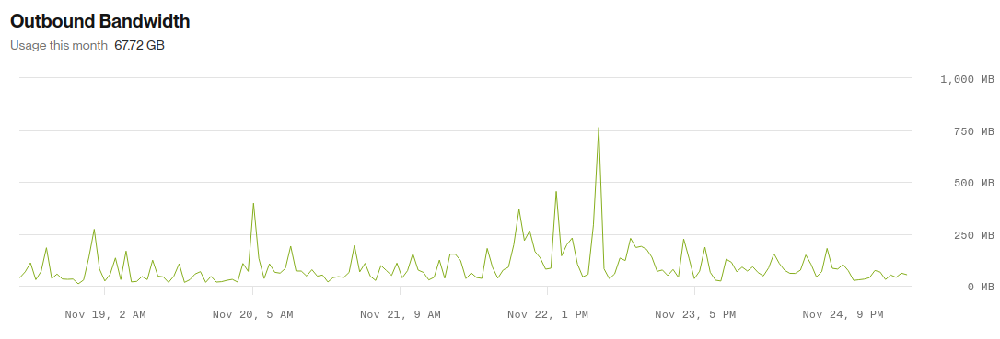
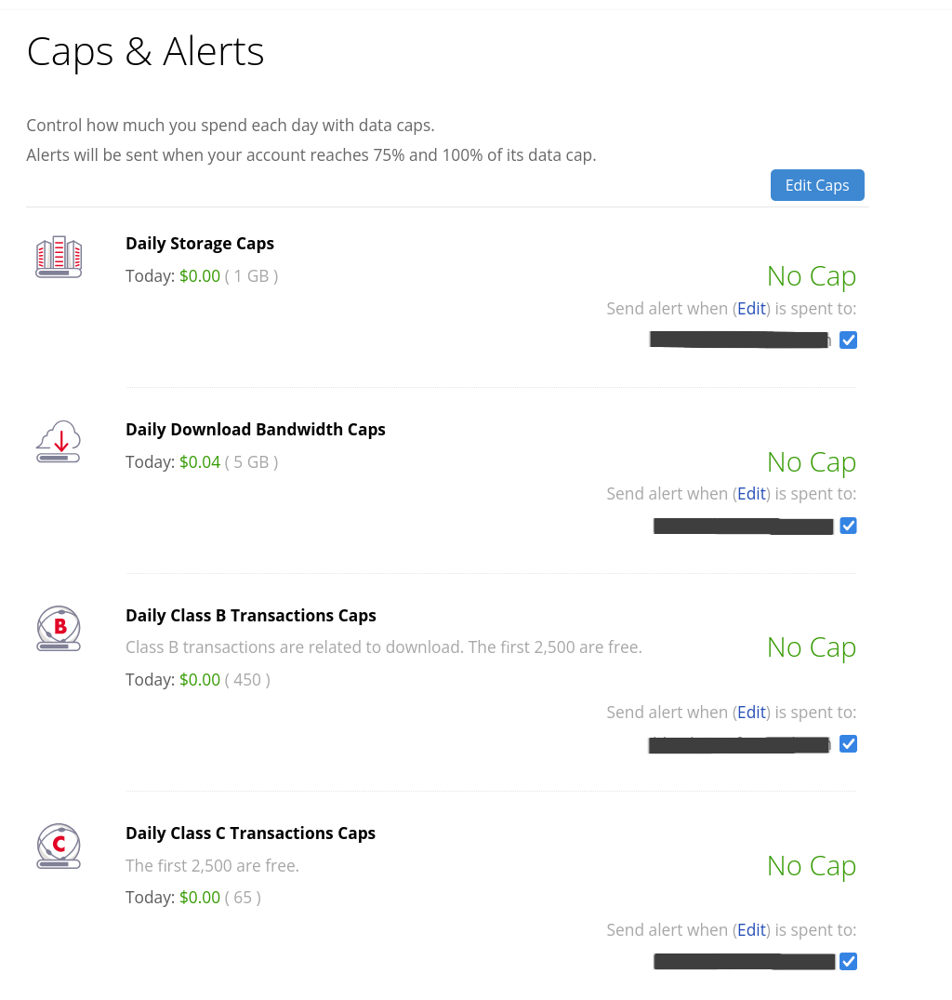

# Scalable Audio Storage

* Date: 2024-12
* Author: @bbstilson
* Owners: @simonv3, @LouisLouiseKay

## Terminology

* [Render](https://render.com/)
* [Minio](https://min.io/)
* [Backblaze](https://www.backblaze.com/)
* [AWS S3](https://aws.amazon.com/s3/)

## Problem

Mirlo uses Render as an infrastructure one-stop shop. This works well as it makes infrastructure and devops simple. The issue, however, is that Render only provides persistent SSDs, which are expensive. At time of writing, Mirlo is configured to use 600GB for Minio, which Render charges $0.30 / GB. This makes the monthly bill much higher than it needs to be. As a crowd-funded platform, we need to be judicious with our cloud spend.

## Storage Requirements

* Durable
  * Audio files should not be lost.
* Secure
  * Audio files should not be exposed to the open internet.
* Performant
  * Streaming audio segments requires real-time throughput (<300ms / request).
* Affordable
  * The closer to free, the better.
* Locally compatible.

## Backblaze (recommended)

Backblaze is a cloud storage and data backup platform tauting "always-how storage" at "1/5 the cost" of other providers. Accessing the platform is possible with a native API and S3-compatible SDKs (e.g., boto3). Backblaze charges $6 / TB / month ($0.006 / GB / month) for storage and egress is free for the first bytes equivalent to 3x average monthly data stored, then $0.01/GB for additional egress.

For Mirlo, based on the previous month's storage and egress, Backblaze would cost ~$3.60 ($0.006 / GB * 600 GB).

This is significantly more affordable than Render, and is nearly free, meeting the Affordability requirement.

Backblaze has 99.9% uptime SLA, and is designed for 11 nines durability, SSE, and SOC-2 compliance. This meets the Durable and Secure requirements.

Similar to Minio, Backblaze is S3-compatible, which means Minio can be used locally for testing without requiring drastic code changes.

### Load Test / Demo

I couldn't find anything on the Backblaze website that talked about performance, so, I ran a simple experiment on a personal Backblaze account from a local WiFi network (that has so-so download speeds). Full code is [here](https://github.com/bbstilson/backblaze-demo/).

I uploaded the same 12MB, .ogg audio file to ~100 different uuid keys to simulate having 100 files. Then I downloaded 100 random files as fast as possible. On average, those downloads took between 567.24ms and 571.19ms. In practice, this will be much faster, and we shouldn't be downloading the full file. Instead, it should just be the segment needed to start the listening and continue the experience. This can be done with a range request.

Regardless, I believe this demonstrates a minimum throughput to meet Performance requirement.

### Other Backblaze Features

#### Caps & Alerts

Backblaze offers Caps & Alerts, which allows us to control how much we spend each day with data caps. If we were to hit these, then the UX would be broken, but it's possibly better than running up a huge bill.

#### Application Keys

Backblaze also offers [Application keys](https://www.backblaze.com/docs/cloud-storage-application-keys) that can be isolated to a single bucket. This allows Mirlo to have different buckets for different environments and prevent the leak of a key from affecting other buckets or keys.

## Alternatives Considered

### AWS S3

AWS S3 is an industry standard block storage service. It provides low-latency, high durability, and low storage costs. It provides several tiers, which enables further cost savings depending on the type of data. For example, audio segments that are needed for streaming can be placed in the highest tier (S3 Standard), and FLAC files for downloads (which are accessed less frequently) can be placed in a lower tier (S3 Infrequent Access).  Minio, Mirlo's current audio file backend service, is S3 compatible, and the mental model is nearly identical.

S3 offers very low latency:

> Other applications are sensitive to latency, such as social media messaging applications. These applications can achieve consistent small object latencies (and first-byte-out latencies for larger objects) of roughly 100–200 milliseconds. - [S3 Performance](https://docs.aws.amazon.com/AmazonS3/latest/userguide/optimizing-performance.html)

So why not use S3? AWS is an abstraction over a data center. Any thing is possible. It requires a high degree of competency, skill, and experience to prevent security issues, exorbinant spending, and to take advantage of all the services that AWS offers to build compelling applications. If Mirlo gains popularity and additional help / funding, then it could be worth setting up an AWS account. Until then, it is the author's opinion that it is best to keep things as simple and approachable for volunteers and existing devs as possible.

## Implementation Plan

1) Create a Backblaze account owned by Mirlo.
   1) Create the requisite buckets and API keys.
   2) Setup data alerts and caps to prevent overspending.
2) Data migration.
   1) Switch from a Minio client to an S3-compatible client. For JS, this is `@aws-sdk/client-s3`.
   2) Add dual writes.
      a) Write to both Render Minio instance and Backblaze.
   3) Migrate data to Backblaze.
   4) Change reads to Backblaze.
   5) Clean up old paths. (writing to Render Minio instance).
   6) Retire Render Minio instance.
